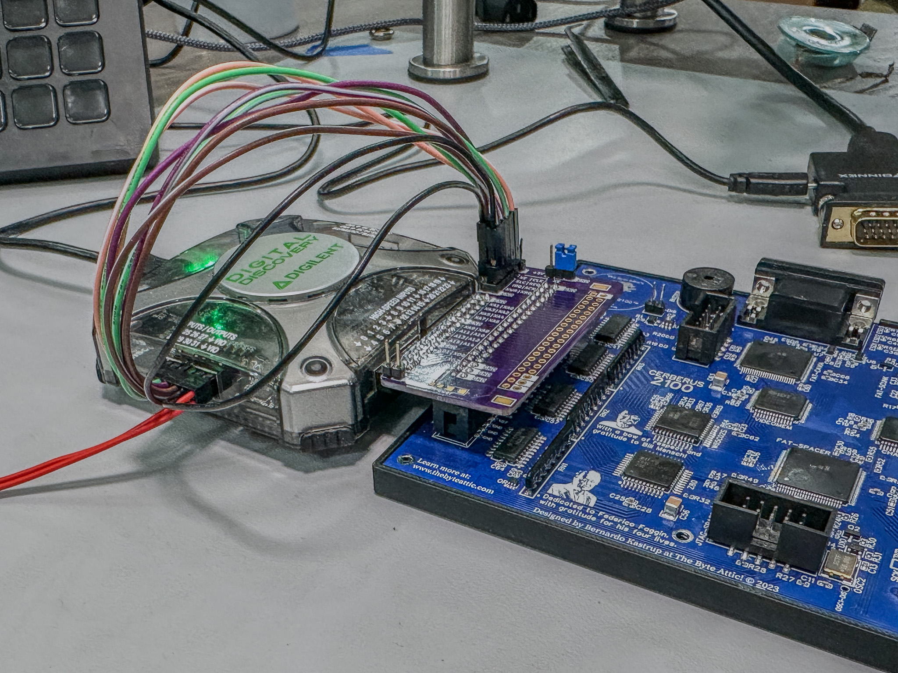

# CERBERUS 2100 Logic Analyzer Adapters

These adapters allow you to connect a logic analyzer to the CERBERUS 2100 expansion port--while having an expansion board connected.

For more information on the computer, check out the [CERBERUS 2100 project page](https://www.thebyteattic.com/p/cerberus-2100.html).

## One-To-One Adapter 
This adapter replicates the CERBERUS 2100's expansion port three times. Pins are mapped "1 to 1" across all three.

## Digital Digital Discovery Adapter
This adapter connects directly to a Digilent Digital Discovery and an expansion board. The signals on the left are grouped to match the input of the Digital Discovery.